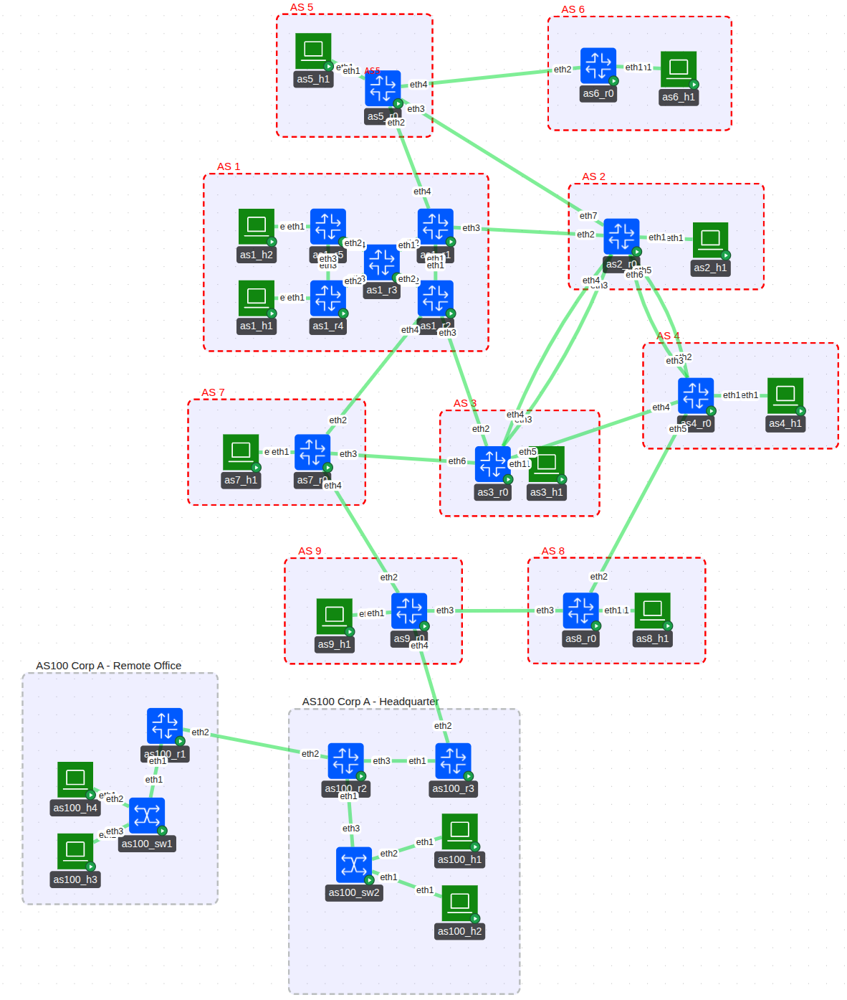

# Exercise 04

## Corp A connecting to Internet


Simple Lab topology for Containerlab to teach about networking



The lab exists of a small mash of a few ISPs and a company "Corp A" which is currently connected to the Internet via it's Headquarter to ISP "AS 9".

The company is small and currently just uses static routing for all it's connection.

For the IP addressing plan and available addresses per ISP / Customer (Corp), see [address_plan.md](address_plan.md) file in this directory

## How to submit the solution

Create a fork of  the repository and submit a solution for each task as a single commit (one commit for Task 1, next commit for Task 2 etc)
Please try to solve each task first without using any AI tools and only use AI if you can't resolve it without. If using AI, then document the prompt you've used with the AI tool to solve the task.

---

## Task 1

The company recently tried to connect their remote office via their own leased line (between`as100_r1` and `as100_r2`). However, their network engineer has trouble to get it's IPv4 connectivity working. The 2 hosts (`as100_h3` and `as100_h4`) can only talk to each other and not reach the headquarter or the Internet.

IPv6 works as expected.

You can see the issue by running the connectivity test program `test.sh` as seen blow.

Your job is to help their network engineer and find the problem in the setup. Do not use any dynamic routing protocol, keep the configuration with static routes.


```
$ ./test.sh 
Ping from each Host to each other host

IPv4:
         as1_h1   as1_h2   as2_h1   as3_h1   as4_h1   as5_h1   as6_h1   as7_h1   as8_h1   as9_h1   as100_h1 as100_h2 as100_h3 as100_h4 
as1_h1   -------     ok       ok       ok       ok       ok       ok       ok       ok       ok       ok       ok      FAIL     FAIL   
as1_h2      ok    -------     ok       ok       ok       ok       ok       ok       ok       ok       ok       ok      FAIL     FAIL   
as2_h1      ok       ok    -------     ok       ok       ok       ok       ok       ok       ok       ok       ok      FAIL     FAIL   
as3_h1      ok       ok       ok    -------     ok       ok       ok       ok       ok       ok       ok       ok      FAIL     FAIL   
as4_h1      ok       ok       ok       ok    -------     ok       ok       ok       ok       ok       ok       ok      FAIL     FAIL   
as5_h1      ok       ok       ok       ok       ok    -------     ok       ok       ok       ok       ok       ok      FAIL     FAIL   
as6_h1      ok       ok       ok       ok       ok       ok    -------     ok       ok       ok       ok       ok      FAIL     FAIL   
as7_h1      ok       ok       ok       ok       ok       ok       ok    -------     ok       ok       ok       ok      FAIL     FAIL   
as8_h1      ok       ok       ok       ok       ok       ok       ok       ok    -------     ok       ok       ok      FAIL     FAIL   
as9_h1      ok       ok       ok       ok       ok       ok       ok       ok       ok    -------     ok       ok      FAIL     FAIL   
as100_h1    ok       ok       ok       ok       ok       ok       ok       ok       ok       ok    -------     ok      FAIL     FAIL   
as100_h2    ok       ok       ok       ok       ok       ok       ok       ok       ok       ok       ok    -------    FAIL     FAIL   
as100_h3   FAIL     FAIL     FAIL     FAIL     FAIL     FAIL     FAIL     FAIL     FAIL     FAIL     FAIL     FAIL   -------     ok    
as100_h4   FAIL     FAIL     FAIL     FAIL     FAIL     FAIL     FAIL     FAIL     FAIL     FAIL     FAIL     FAIL      ok    -------  

IPv6:
         as1_h1   as1_h2   as2_h1   as3_h1   as4_h1   as5_h1   as6_h1   as7_h1   as8_h1   as9_h1   as100_h1 as100_h2 as100_h3 as100_h4 
as1_h1   -------     ok       ok       ok       ok       ok       ok       ok       ok       ok       ok       ok       ok       ok    
as1_h2      ok    -------     ok       ok       ok       ok       ok       ok       ok       ok       ok       ok       ok       ok    
as2_h1      ok       ok    -------     ok       ok       ok       ok       ok       ok       ok       ok       ok       ok       ok    
as3_h1      ok       ok       ok    -------     ok       ok       ok       ok       ok       ok       ok       ok       ok       ok    
as4_h1      ok       ok       ok       ok    -------     ok       ok       ok       ok       ok       ok       ok       ok       ok    
as5_h1      ok       ok       ok       ok       ok    -------     ok       ok       ok       ok       ok       ok       ok       ok    
as6_h1      ok       ok       ok       ok       ok       ok    -------     ok       ok       ok       ok       ok       ok       ok    
as7_h1      ok       ok       ok       ok       ok       ok       ok    -------     ok       ok       ok       ok       ok       ok    
as8_h1      ok       ok       ok       ok       ok       ok       ok       ok    -------     ok       ok       ok       ok       ok    
as9_h1      ok       ok       ok       ok       ok       ok       ok       ok       ok    -------     ok       ok       ok       ok    
as100_h1    ok       ok       ok       ok       ok       ok       ok       ok       ok       ok    -------     ok       ok       ok    
as100_h2    ok       ok       ok       ok       ok       ok       ok       ok       ok       ok       ok    -------     ok       ok    
as100_h3    ok       ok       ok       ok       ok       ok       ok       ok       ok       ok       ok       ok    -------     ok    
as100_h4    ok       ok       ok       ok       ok       ok       ok       ok       ok       ok       ok       ok       ok    -------  
```

---

## Task 2

The company realized that they need to expand more and static routes are getting too painful. Change the setup to use BGP externally (`AS100_R3` to `AS9_R0`) and OSPFv2 (for IPv4) and OSPFv3 (IPv6) internally. Remove all the unneeded static routes

AS Number for Corp A is 100
IP addresses stay as assigned

---

## Task 3

The company opens another location (called "satellite office" for the exercise) even further away than the current *remote office*.
They get a similar topology than the current remote office and their connection connects from the *satellite office* router to the remote office router (not directly to the headquarter).

Extend the topology and routing to add the satellite office. For available addresses, please consult the addressing plan of allocated addresses to the Company.

---

## Task 4

The company gets a new director who used to work at a large Telco. He thinks that the current setup with OSPFv2 and OSPFv3 is a bad design and wants to use ISIS as the routing protocol.

Change the setup to use ISIS instead of OSPFv2 & OSPFv3 for the routing. 